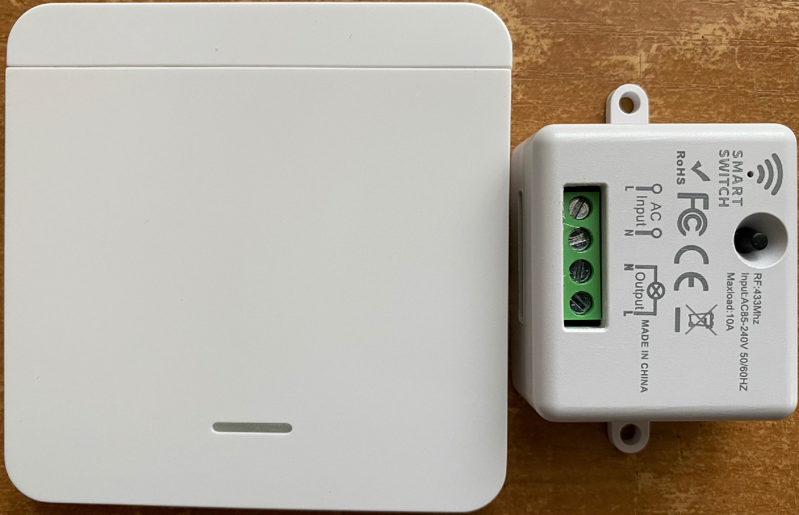
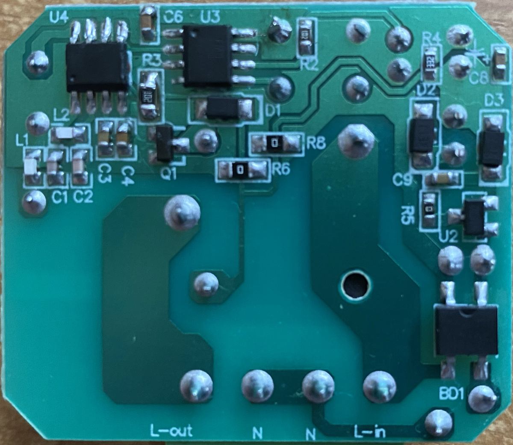
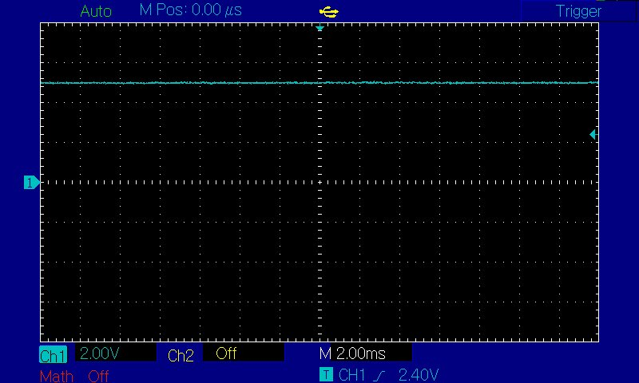
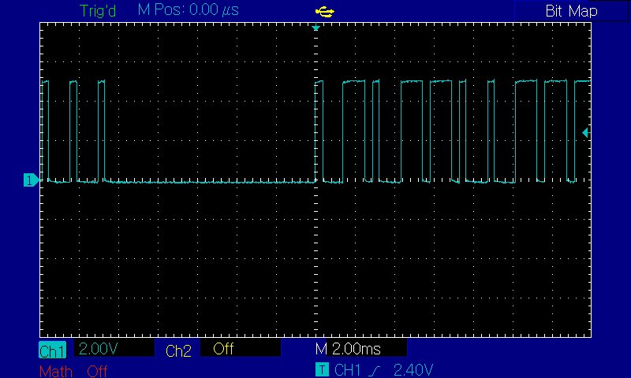
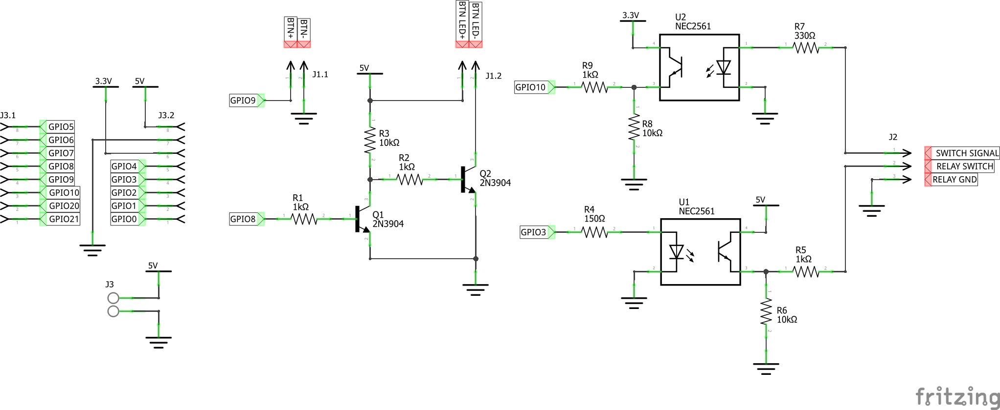
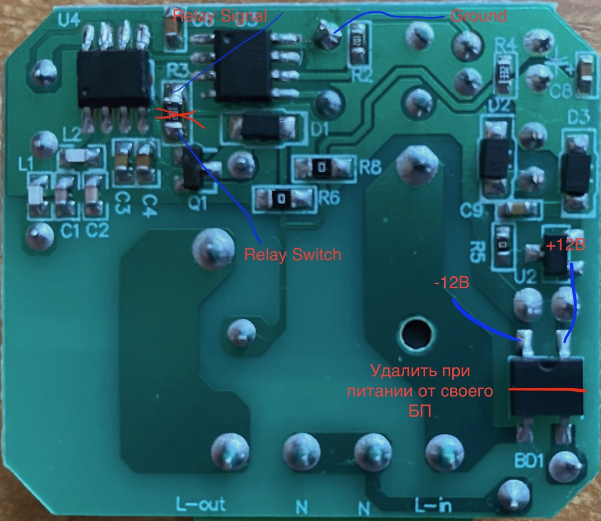
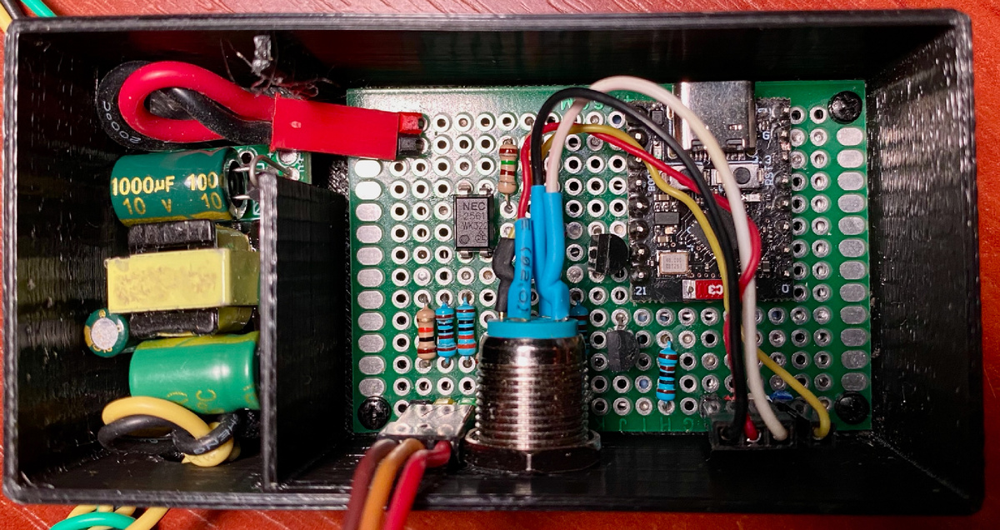

# Smart RF Switch
  **433Mhz RF Switch to HomeKit connection**
  
  Smart light bulbs, smart relays, and other “smart” devices in the home are cool. But! There's always that damn “but.” At 3 a.m., when everyone is asleep, yelling, “Hey Siri! Turn on the kitchen light” is not a good idea. And constantly reaching for your smartphone to turn something on or off is also not a good idea. You can, of course, put motion sensors in, but there are nuances with them. So you can't do without switches.

  My first impulse was to buy a switch that is compatible with my smart home system (and I have an Apple Home, mind you). I looked at what was on sale. First of all, most are from the Chinese and required their own application that somehow cleverly threw something there somewhere. Secondly, which is quite sad, most required a prepared wiring or ZigBee gateway, or both. In general, the option fell away for several reasons.

  The second thought (which comes later) was to buy any switch at all and wire it to the Apple Home via HomerBridge. This idea again ran into ZigBee hubs and wiring.

  Having given up on all this nonsense and racking my brains, I suddenly remembered that I'm a programmer. What should we do to make a switch ourselves? No problem. We take a radio relay and build it. I stalled on the fact that I was too lazy to print a normal switch button. So the idea was put aside in not a very long.

  So, not too long ago, I was looking for something online and decided to see what's out there in the smart switch technology realm. And I found a cool thing: a full-size switch with a relay on 433 MHz. And the main thing is that this switch (the button itself) works from a battery, and the relay is connected to the wires of the chandelier (or bulb). Thus, special wiring for it is not needed.

  > Let me make it clear: by “special wiring”, I mean phase and zero wiring to the light switch. That is, you should have three wires coming to the switch: phase from the switchboard (which is broken), phase to the chandelier, and zero from the switchboard. Usually, the standard wiring to the switch is just two wires: phase from the switchboard, and it goes to the chandelier (phase break). There is no zero there.

  Here is the switch.

  

  The only thing left to do is to make this switch compatible with Apple Home. Naturally, I will use the ESP32 in conjunction with the Arduino HomeSpan library. I have been friends with this library for a long time, and I already have devices made on its basis. Yes, and the experience of the “adaptation” radio call (also on 433) I already had. No problems were expected.

  Before breaking the relay, I looked in the manual. And there I found a mention that more than one button can be attached to the relay. Interesting, I thought, so the buttons are different somehow. Well, it's time to open this marvelous device of Chinese industry. The button is of little interest to me; it's just an ordinary RF transmitter. It works, and it's good. But the relay should be studied in detail. The case is not glued, not sealed, and in general, it opens easily. Here's what I got out of this white box.

  

  In the right part of the board, you can see a transformerless (you should take note of it!) power supply assembled on diode bridge BD1. Some microcircuit U2 (I suspect it is a stabilizer for some volts) with marking IVAP302 (couldn't find what it is; if you know what it is, please write in comments), diodes D2 and D3, and some stuff (capacitors, resistors). Several elements are not labeled and soldered on the back side of the board. In particular: a ballast resistor and a couple of smoothing capacitors. All in all, nothing interesting. The only thing that interested me here is the stabilizer. Since it determines the supply voltage of the rest of the circuit and, as a consequence, the options for matching it (the circuit) with ESP32. You can stupidly measure the output voltage from the power supply, and then you can figure it out by indirect signs. I decided on the second option because I still need to find out the “protocol” of communication between the button and the relay.

  In the left part of the board there is the relay control circuit itself, consisting of two microcircuits, U4 (the name is lost) and U3 (marking FMD FT60E011A F269RKE), some loose parts, transistor Q1, and, actually, the relay itself. Relay marking: BRD-SS-105LMF. And this indicates that the relay is a five-volt relay. Which is very good and hints that the circuit works from 5 volts. Of course, it is not certain that the rest of the circuit is powered by five volts, since the relay is switched through a transistor, but it is something. It's unlikely to be more than that.

  A quick Google search for FT60E011A gives us a link to a data sheet that shows that this is a simple microcontroller. This is also indicated by the fact that to this chip (U3) are connected the button, the LED, the base of transistor Q1 (via current-limiting resistor R3), and the second chip (U4). Hence, U4 is an RF chip. And it transmits the received signal to the microcontroller. In this case I am not interested in the RF chip itself and its piping, so I will not describe what is there and how. It's just a bunch of capacitors and an antenna.

  > Transistor Q1 in this circuit works as a key: it allows a small current from the microcontroller to control a relatively large relay winding current. Usually microcontroller outputs are designed for currents of a couple of tens of milliamperes. But the relay itself consumes much more current (it can even reach hundreds of milliamperes). The microcontroller will simply not be able to deliver such current to its outputs. And if it can, it is very likely to burn out. This is why a transistor key is used. Well, diode D1 dampens the reverse energy discharge from the relay coil.

  Now I need to figure out what exactly the RF chip sends to the microcontroller and how the microcontroller controls the relay. I'll look at the signal levels as well. It's time to poke around with an oscilloscope.

  Before poking with oscilloscope probes, we should solve the problem with the power supply. I don't really want to get into the device, which is directly powered from 220 without isolation. I decided to supply power directly after the diode bridge from a laboratory power supply unit. It started from 12 volts.

  Signal from the RF chip to the IC without a button command. Occasionally there's some interference. But it's mostly quiet.

  

  If you press the button, the RF chip starts transmitting something to the microcontroller. I suspect it is the code of the button.

  

  The screenshot doesn't show everything, but it's a pretty long sequence. You can immediately see that the signal has a 5-volt level, which is very, very good. Well, and the relay is 5 volts, as I mentioned above. So there will be no problems with level matching.

  I didn't really want to decode and emulate the signal, so I also looked at the relay control signal (on R3 on the microcontroller side). I will not give the oscillogram; everything is expected there. Either constantly high level (5 volts) when the relay is turned on (closes the output contacts). Or constantly low when the output is open.

  In general, I decide to connect to the gap between the microcontroller and Q1. To do this, it will be necessary to unsolder resistor R3. I have sketched this connection diagram.

  

  According to the scheme, everything is very simple. Opto isolation from the relay (since I remember that there is a transformerless power supply, which has no galvanic isolation from the 220-volt network). Switch The signal is soldered to the microcontroller output, which goes to the top pin of R3. Relay switch—to the lower pin of resistor R3 (which is soldered out), to the base of transistor Q1. And the ground to any “-” point on the relay board. There is a very convenient one next to R2. BTN+ and BTN-: Here you can connect an external button to control ESP32 (for details see the HomeSpan help). BTN LED+ and BTN LED- are the indicator LEDs. I have a button with a built-in LED, which is very convenient. Again, refer to the HomeSpan help for details.

  

  There is only one problem left: the ESP32 power supply. The initial idea to power everything from a single 5 volt power supply has failed so far, because the stabilizer starts only from 12 (or rather, the power supply circuit starts from 12, the stabilizer would probably start from 6). It is possible, of course, to supply power directly, bypassing the entire power supply circuit, but, frankly speaking, I did not want to unsolder a lot of parts. I wanted to leave the possibility to quickly reset the relay.

  > If you want to power the relay from your own power supply, then 12 volts should be supplied to the output (upper on the photo) contacts of the diode bridge (BD1). The left one is “+,” the right one is “-.” The diode bridge must be soldered out! The circuit consumes less than 100 milliamperes when powered from 12 volts.

  I decided to leave the relay power supply as it is and use a separate 5-volt power supply to power the ESP32. Thus, I will only need to remove resistor R3 and solder three wires.

  Important point! It is necessary that the power supply used is completely galvanically isolated from the 220 network. Otherwise, all the white smoke will come out very quickly. Fortunately, I have such a PSU.

  In general, everything is thought out—solder. I didn't bother much with the board layout. Then I printed the box and connected the button. Here it is, all assembled.

  

  I've got the electrics and electronics sorted out. It's time to prepare the firmware. Well, there are no special problems with it. The logic is quite simple: since the control signal has a logic level and is constant for a given state (always 5V if the relay is on and always 0V if the relay is off), the optimal solution is to use interrupts on the change of signal level. It doesn't matter what the relay MC outputs. What matters is when that signal changes. You can tell by the signal change that the button was pressed. And what actually needs to be done with the relay (on or off) depends solely on the internal state of the ESP32 firmware. This allows the relay to be controlled independently of the current state of the control signal, either by the button or from Apple Home.

  **Support the project**
  
  If you like the project you can support me by the following link:
  
  **USD**: https://buymeacoffee.com/dronetales  
  **BTC**: bitcoin:1A1WM3CJzdyEB1P9SzTbkzx38duJD6kau  
  **BCH**: bitcoincash:qre7s8cnkwx24xpzvvfmqzx6ex0ysmq5vuah42q6yz  
  **ETH**: 0xf780b3B7DbE2FC74b5F156cBBE51F67eDeAd8F9a  
  **Boosty**: https://boosty.to/drone_tales/donate  
